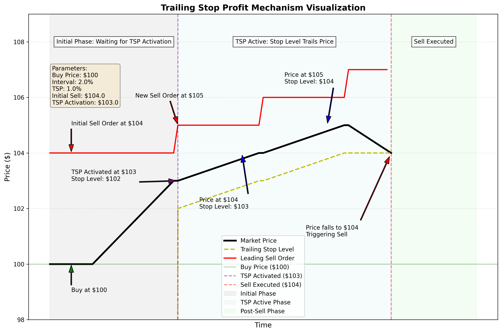
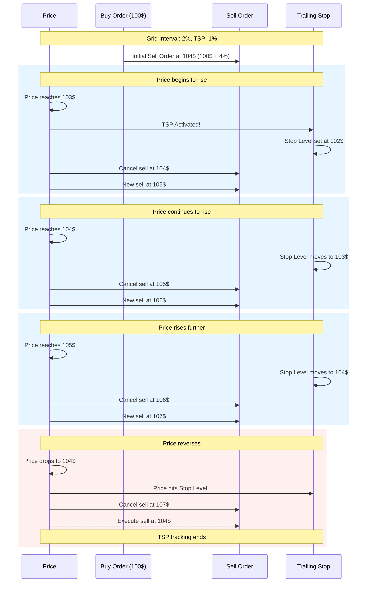

# Trailing Stop Profit Concept

Concept: Optional Custom Trailing Stop Profit

In order to increase profits by running them beyond the defined interval, we
could implement a custom trailing stop profit mechanism.

This mechanism must ensure that the profit made by a trade is at least based on
the defined interval or better. This "_or better_" can be realized by letting
profits run $x$% beyond the defined interval and then lock in profits, in case
the price come back down, while ensuring to not sell below the defined interval.

## Parameter Summary

| Parameter           | Value | Description                                        |
| ------------------- | ----- | -------------------------------------------------- |
| Buy Price           | 100 $ | Initial price when buy order is executed           |
| Grid Amount         | 100 $ | Amount invested                                    |
| Interval            | 2 %   | Minimum profit target percentage                   |
| TSP                 | 1 %   | Trailing stop profit percentage                    |
| Initial Sell Target | 104 $ | Initial sell order (interval + 2x TSP)             |
| TSP Activation      | 103 $ | Price at which TSP becomes active (interval + TSP) |

## Visualization



## Gherkin Sample Specification and Visualization

```gherkin
Feature: Trailing Stop Profit
  As a trader
  I want to implement a trailing stop profit mechanism
  So that I can maximize profits when the price trends upward

  Background:
    Given the grid amount is 100 $
    And the interval is 2 %
    And the trailing stop profit (TSP) is 1 %

  Scenario: Managing buy order with trailing stop profit
    When a buy order at 100 $ is executed
    Then a sell order O1 is placed at 104 $ (interval + 2x TSP)

    Scenario: Price falls to or below buy price
      Given a buy order at 100 $ was executed
      And a sell order O1 exists at 104 $
      When the price falls to or below 100 $
      Then no action is taken

    Scenario: Price rises to 103 $ (interval + TSP)
      Given a buy order at 100 $ was executed
      And a sell order O1 exists at 104 $
      When the price rises to 103 $ (interval + TSP) # now TSP gets activated
      Then the system remembers to sell at 102 $ in case the price drops
      And the sell order O1 at 104 $ is canceled
      And a new sell order O2 is placed at 105 $ (interval + 3x TSP)

      Scenario: Price falls after reaching 103 $ (interval + TSP)
        Given the price reached 103 $
        And a sell order O2 exists at 105 $
        When the price falls to or below 102 $
        Then the sell order O2 is canceled
        And a limit sell order is created at 102 $
        # This is the end, no longer tracking of TSP

      Scenario: Price rises to 104 $ (interval + 2x TSP)
        Given the price reached 103 $
        And a sell order O2 exists at 105 $
        When the price rises to 104 $ (interval + 2x TSP)
        Then the system remembers to sell at 103 $ in case the price drops
        And the sell order O2 is canceled
        And a new sell order O3 is placed at 106 $ (interval + 4x TSP)

        Scenario: Price falls after reaching 104 $ (interval + 2x TSP)
          Given the price reached 104 $
          And a sell order O3 exists at 106 $
          When the price falls to or below 104 $
          Then the sell order O3 is canceled
          And a limit sell order is created at 103 $
          # This is the end, no longer tracking of TSP

        Scenario: Price rises to 105 $ (interval + 3x TSP)
          Given the price reached 104 $
          And a sell order O3 exists at 106 $
          When the price rises to 105 $ (interval + 3x TSP)
          Then the system remembers to sell at 104 $ in case the price drops
          And the sell order O3 is canceled
          And a new sell order O4 is placed at 107 $ (interval + 5x TSP)

          Scenario: Price falls after reaching 105 $ (interval + 3x TSP)
            Given the price reached 105 $
            And a sell order O4 exists at 107 $
            When the price falls to 104 $ (interval + 2x TSP)
            Then the sell order O4 is canceled
            And a limit sell order is created at 104 $
            # This is the end, no longer tracking of TSP
```


